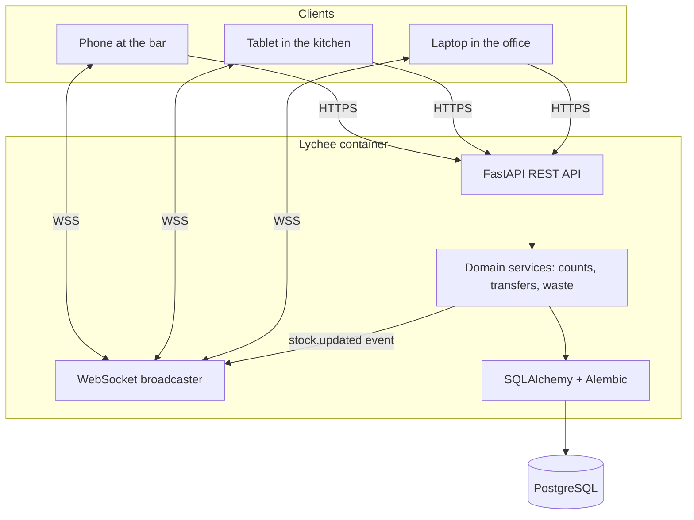
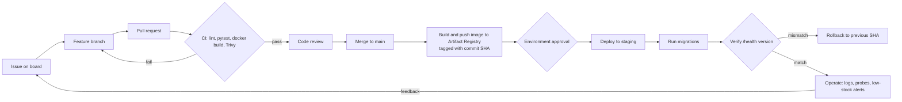

# Lychee: Multi-Venue Restaurant Inventory Tracker

**Course:** SDI 4213/5213-980, DevOps CI/CD, Fall 2026
**Project type:** Semester-long group project
**Course project option:** Option 1, Inventory Tracker
**Document purpose:** Working plan for the team. Covers what we are building, how it is scoped, the week-by-week schedule mapped to course milestones, and the technical decisions a new team member needs in order to contribute.

---

## 0. How to read this document

Sections 1 through 9 describe the application and the technical plan. Section 10 is the week-by-week schedule and is the part you will use most often. Sections 11 through 17 are reference material for specific milestones. Section 18 lists the assumptions made while writing this, which need confirmation before Week 1 is submitted.

One framing note that matters more than anything else in here: the course states that the purpose is not to build the most complex application possible, but to demonstrate a professional software delivery workflow. The grading rubric backs that up. Application functionality is 10 percent of the final grade, and the other 90 percent is workflow, testing, CI, containers, security, deployment, IaC, Kubernetes, and documentation. Lychee should therefore be an honest, working, modest application that gives the pipeline something real to carry. Every feature idea should be measured against whether it makes the pipeline demo better, not whether it makes the app more impressive.

---

## 1. Project charter

Fill in the bracketed fields before submitting Week 1.

```
Project Name:       Lychee
Team Members:       [names and GitHub handles]
Application Purpose: A multi-venue restaurant inventory tracker that lets rotating
                     staff log stock counts in the informal units they already use,
                     tracks bar, dry, and cold goods as distinct categories, and keeps
                     two venues sharing one physical kitchen in sync in close to real time.
Target Users:       Primary: rotating front- and back-of-house staff recording counts
                    during or between shifts.
                    Secondary: shift leads, kitchen managers, and owners who review
                    stock, transfer between venues, and reconcile costs.
Primary Features:   Fast count entry in natural units, three inventory categories with
                    category-specific units and cadence, shared-pool and per-venue stock
                    tracking with transfers, waste logging, low-stock reporting, and live
                    updates pushed to every connected device.
Technology Stack:   Python 3.12, FastAPI, SQLAlchemy, Alembic, PostgreSQL 16, vanilla
                    JS + HTML frontend, Pytest, Docker, Docker Compose, GitHub Actions,
                    Trivy + Dependabot + CodeQL, Terraform/OpenTofu, Kubernetes (kind),
                    Google Cloud Run + Artifact Registry, free serverless Postgres.
Repository Link:    [https://github.com/<org-or-user>/lychee]
```

---

## 2. Application description

### 2.1 The problem in one paragraph

Restaurants track three kinds of stock that behave differently. Bar stock is counted by partial bottle. Dry goods are counted by case or unit. Cold goods are counted by weight or head, turn over fastest, and cost the most when the count is wrong, because spoiled product cannot be sold at all. Most inventory tools flatten all three into a generic line item with a quantity, which does not match how staff think. The problem gets worse for restaurant groups where two concepts, for example a daytime cafe and an evening bar, run out of one physical kitchen. One walk-in, one dry storage room, and one bar back stock physically hold product for two businesses that each need their own accurate numbers for costing, ordering, and waste. On top of that, the people counting are rotating hourly staff on whatever device is nearby, so entry has to be fast and forgiving, and the numbers have to match across a phone at the bar, a tablet in the kitchen, and a laptop in the office within seconds.

### 2.2 What Lychee does about it

Lychee is a web application and API with four ideas at its center.

**Natural unit entry.** Staff record what they see. Two-thirds of a bottle, one and a half cases, three heads of lettuce. Lychee stores a canonical base quantity internally and converts on the way in, so nobody has to do arithmetic before they can record anything. The original entry is preserved alongside the converted value so the count can be shown back the way it was entered.

**Three real categories.** Bar, dry, and cold are first-class categories, each with its own default base unit, its own set of allowed natural units, its own rules about fractional entry, and its own expected count cadence. Cold goods are flagged for more frequent counts because the cost of a stale number is highest there.

**Shared pool plus per-venue ownership.** Physical storage locations, the walk-in and the dry room and the bar back, are modeled separately from venues. A quantity of stock sits in a location and is owned either by a specific venue or by the shared pool. Moving ownership is a transfer, which is recorded as its own event with a timestamp and an actor, so neither venue loses track of what it is responsible for and no count has to be entered twice.

**Live updates.** Mutations broadcast over a WebSocket to every connected client, so a count logged at the bar appears on the manager's screen in seconds rather than after an overnight batch.

### 2.3 Feature list

Core, required for the midterm checkpoint in Week 8:

1. Item catalog with category, base unit, and per-item allowed natural units.
2. Count entry that accepts a value plus a natural unit and converts to base.
3. Stock view filtered by venue, category, and storage location.
4. Transfers between venues and between venue and shared pool.
5. Waste logging, which is a count reduction with a reason code.
6. Low-stock report based on per-venue par levels.
7. Health endpoint and structured logs.

Added after the midterm, if time allows:

8. Live WebSocket updates to connected clients.
9. Count history per item with who counted and when.
10. Simple cost report, quantity on hand times unit cost, per venue.

Explicitly out of scope. Say no to these, and put that in the README so the instructor sees the scoping decision was deliberate:

- POS or supplier API integration.
- Purchase order generation and vendor management.
- Demand forecasting or par level suggestions.
- Real user accounts, password reset, or role-based permissions beyond a staff PIN and a manager flag.
- Barcode scanning, photo upload, offline-first sync.
- Recipe costing and menu engineering.

### 2.4 User stories worth writing as GitHub Issues

- As bar staff mid-shift, I open Lychee on my phone, tap the gin, drag a bottle-fill slider to two-thirds, and submit, in under ten seconds.
- As a line cook, I count the walk-in by weight in pounds and Lychee stores grams without me knowing or caring.
- As a shift lead, I move six cases of oat milk from the shared pool to the cafe venue and both venue totals update immediately.
- As a kitchen manager, I open the low-stock report for the evening bar and see only items below par for that venue.
- As an owner, I look at the cold goods list and see which items have not been counted in more than twenty-four hours.

---

## 3. Domain model

This is the part of Lychee that is genuinely interesting to design and, conveniently, the part that is easiest to write good automated tests against. Section 12 leans on it.

### 3.1 Core concepts

| Concept | Meaning |
|---|---|
| Venue | A business concept, for example Cafe or Evening Bar. Logical, not physical. |
| Storage location | A physical place stock sits: walk-in, dry storage, bar back. Shared between venues. |
| Item | A trackable product, for example London dry gin, canned tomatoes, romaine. Has a category and a base unit. |
| Item unit | A natural unit valid for one item, with a conversion factor to that item's base unit and a flag for whether fractional entry is allowed. |
| Stock level | Current quantity in base units for one item, in one location, owned by one venue or by the shared pool. |
| Count | A snapshot event that sets the stock level to an observed value. |
| Transfer | A move of quantity between owners or locations. Conserves total quantity. |
| Waste | A reduction with a reason code, for spoilage, breakage, or comp. |

### 3.2 Units, the important design decision

Every item declares a base unit. Everything is stored in base units. Staff never see base units unless they ask for them.

| Category | Typical base unit | Example natural units | Fractional entry |
|---|---|---|---|
| Bar | milliliter | bottle 750 ml, liter bottle 1000 ml, case of 12 bottles, milliliter | Yes, tenths of a bottle |
| Dry | each | case of 12, sleeve of 8, bag, each | Whole units, plus loose count outside the case |
| Cold, weight-based | gram | pound 453.592 g, kilogram 1000 g, gram | Yes, to one decimal |
| Cold, count-based | each | head, bunch, case of 24, each | Yes for partial cases |

Note that the base unit belongs to the item, not to the category. Cold goods split into weight-based and count-based items, and both need to work. Do not hard-code a single base unit per category, or lettuce and ground beef will fight each other.

Conversion is a single small function, which makes it a perfect unit test target:

```python
def to_base(quantity: Decimal, unit: ItemUnit) -> Decimal:
    if not unit.allow_fractional and quantity % 1 != 0:
        raise ValueError(f"{unit.label} must be counted in whole units")
    return (quantity * unit.factor_to_base).quantize(Decimal("0.001"))
```

Use `Decimal`, not `float`. Two-thirds of a bottle in floating point will produce numbers that look wrong on screen, and inventory that looks wrong stops being trusted, which is exactly the failure mode the problem statement describes.

### 3.3 Tables

```
venue(id, name, active)

storage_location(id, name, kind)            kind in (walkin, dry, bar_back)

item(id, name, category, base_unit, unit_cost, count_cadence_hours, active)
                                            category in (bar, dry, cold)

item_unit(id, item_id, label, factor_to_base, allow_fractional, is_default)

stock_level(id, item_id, location_id, owner_venue_id NULLABLE, quantity_base,
            updated_at)
                                            owner_venue_id NULL means shared pool
            UNIQUE(item_id, location_id, owner_venue_id)

par_level(id, item_id, venue_id, minimum_base)

count_event(id, stock_level_id, entered_quantity, entered_unit_id, quantity_base,
            previous_quantity_base, counted_by, counted_at, note)

transfer(id, item_id, from_owner_venue_id NULLABLE, to_owner_venue_id NULLABLE,
         from_location_id, to_location_id, quantity_base, created_by, created_at)

waste_event(id, stock_level_id, quantity_base, reason, created_by, created_at)
```

Two invariants worth stating explicitly, because they become tests:

1. A transfer never changes the sum of `quantity_base` across all stock levels for that item.
2. No operation may drive a `stock_level.quantity_base` below zero. Reject with a 4xx and a readable message rather than silently clamping.

### 3.4 Architecture diagram

Drop this into `docs/architecture.md`. The course accepts Mermaid.



---

## 4. API surface

Keep it small. Nine or ten endpoints is plenty for a full demo.

| Method | Path | Purpose |
|---|---|---|
| GET | `/health` | Liveness. Returns version and status without touching the database. |
| GET | `/ready` | Readiness. Runs `SELECT 1` against the database. |
| GET | `/api/venues` | List venues. |
| GET | `/api/items` | List items. Filters: `category`, `venue_id`, `location_id`, `low_stock`. |
| POST | `/api/items` | Create an item with its allowed units. |
| GET | `/api/items/{id}` | Item detail with current stock by owner and recent counts. |
| POST | `/api/counts` | Record a count. Body: item, location, owner venue, quantity, unit id, note. |
| POST | `/api/transfers` | Move quantity between owners or locations. |
| POST | `/api/waste` | Record waste with a reason. |
| GET | `/api/reports/low-stock` | Items under par, filtered by venue. |
| WS | `/ws/stock` | Push `stock.updated` events to connected clients. |

Separating `/health` from `/ready` is worth the extra ten lines. In Week 13 they map cleanly onto the Kubernetes liveness and readiness probes, and having a liveness check that does not depend on the database is what stops Kubernetes from restarting healthy pods during a brief database blip.

FastAPI generates OpenAPI docs at `/docs` for free, which is a good thing to show during the final demo.

---

## 5. Technology stack and why

| Layer | Choice | Reasoning |
|---|---|---|
| Language | Python 3.12 | Approved, and the whole team can read it. |
| Framework | FastAPI | Approved by the course. Native WebSocket support, which the shared-kitchen requirement needs. Automatic OpenAPI docs. Pydantic gives request validation for free, which matters when the input is fractional quantities from a phone. |
| ORM and migrations | SQLAlchemy 2.x with Alembic | Migrations are a deployment concern, so having them from Week 3 avoids a painful retrofit in Week 10. |
| Database | PostgreSQL 16 | Satisfies the Week 7 requirement for a supporting service. Real numeric type for `Decimal` quantities. |
| Frontend | Server-rendered HTML with Jinja2 plus a small amount of vanilla JS | Deliberately boring. A React build step adds pipeline complexity that earns no rubric points. If the team wants a build step, that is a defensible choice, but decide in Week 3, not Week 11. |
| Tests | Pytest with httpx TestClient | Approved, fast, and easy to run in CI. |
| Container | Docker, multi-stage, non-root user | Week 6 and Week 9. |
| Local orchestration | Docker Compose | Week 7. |
| CI/CD | GitHub Actions | Weeks 4, 5, 10. |
| Security | Dependabot, CodeQL, Trivy | Week 9 needs at least two. We plan three. |
| IaC | Terraform or OpenTofu | Week 12. See section 15. |
| Kubernetes | kind | Week 13. Lighter than Minikube and loads local images easily. |

---

## 6. Repository structure

Close to the structure the course suggests, with small additions for migrations and the frontend.

```
lychee/
├── README.md
├── CONTRIBUTING.md
├── CHANGELOG.md
├── Dockerfile
├── docker-compose.yml
├── .env.example
├── .github/
│   ├── workflows/
│   │   ├── ci.yml
│   │   ├── security.yml
│   │   └── deploy.yml
│   ├── ISSUE_TEMPLATE/
│   └── pull_request_template.md
├── app/
│   ├── main.py            FastAPI app, routers, WebSocket endpoint
│   ├── config.py          settings from environment variables
│   ├── models.py          SQLAlchemy models
│   ├── schemas.py         Pydantic request and response models
│   ├── units.py           conversion logic, the heart of the app
│   ├── services/          counts, transfers, waste, reports
│   ├── templates/         Jinja2 templates
│   └── static/            css, js, lychee-logo.svg, favicon
├── migrations/            Alembic
├── tests/
│   ├── test_health.py
│   ├── test_units.py
│   ├── test_counts.py
│   ├── test_transfers.py
│   └── test_reports.py
├── infra/
│   ├── main.tf
│   ├── variables.tf
│   └── outputs.tf
├── k8s/
│   ├── deployment.yaml
│   ├── service.yaml
│   ├── configmap.yaml
│   └── secret-example.yaml
└── docs/
    ├── architecture.md
    ├── pipeline.md
    ├── runbook.md
    └── security.md
```

---

## 7. Team roles

The course requires an individual contribution statement from each member, so roles should be real, but everyone must still be able to explain any part of the project during the demo. Rotate the pull request reviewer so no single person becomes the only one who understands CI.

With three people, there is no room for a dedicated documentation or testing owner, so those two responsibilities are shared standing requirements rather than a role. Every pull request ships with tests, and every week's owner writes the documentation for the thing they built, in the same pull request.

| Role | Owns | Heaviest weeks | Lighter weeks |
|---|---|---|---|
| Application lead | Domain model, `units.py`, API endpoints, templates, seed script | 3, 5, 8 | 12, 13 |
| Pipeline lead | GitHub Actions, releases, GCP deploy workflow, security scanning | 4, 5, 9, 10, 11 | 6, 7 |
| Platform lead | Dockerfile, Compose, Terraform, Kubernetes, observability | 6, 7, 12, 13, 14 | 3, 4 |

Notice the load is uneven across the semester rather than across people. The application lead carries Weeks 3 through 8 and then has capacity from Week 12 onward, which is exactly when the platform lead is buried in Kubernetes and the runbook. Plan for that: when your heavy weeks are over, pick up issues from whoever is in theirs. The lighter-weeks column is a rough guide to who has slack.

Shared, non-negotiable, with three people:

- **Review rotation.** Nobody merges their own work. With three, that means the two non-authors alternate as reviewer, so each person reviews roughly a third of the codebase they did not write. This is the main defense against the failure mode where one person is the only one who understands CI on demo day.
- **Tests ship with features.** There is no separate testing week and no separate testing person.
- **Documentation ships with features.** README, runbook section, or diagram, updated in the same pull request as the change.
- **Each person owns four of the twelve demo items** in Week 16 and must be able to answer questions on any of them.

---

## 8. Collaboration workflow

Set this up in Week 2 and do not deviate, because the Week 16 demo explicitly shows issues, branches, pull requests, and code reviews.

- **Branching:** trunk-based with short-lived feature branches. `main` is always deployable. Branch names follow `feat/count-entry`, `fix/transfer-negative`, `docs/runbook`, `chore/deps`.
- **Protection on `main`:** require a pull request, require one approving review, require the CI check to pass. Turn this on in Week 4 once CI exists, because turning it on earlier will block you before there is a check to satisfy.
- **Issues:** every pull request references an issue. Labels: `area:app`, `area:pipeline`, `area:infra`, `area:docs`, plus `week-04` style labels so the board maps to milestones.
- **Project board:** columns for Backlog, This Week, In Progress, In Review, Done. Create one milestone per course week.
- **Commits:** conventional style, for example `feat(counts): accept fractional bottle entry`. This makes the Week 5 changelog nearly free to write.
- **Pull request template:** what changed, why, how it was tested, screenshots if UI, and a checklist item confirming no secrets were added.

A word on commit history. The rubric mentions meaningful commit history, and a repository where all fifteen weeks appear in three commits from one account on the last weekend is visible from a long way off. Commit weekly, from every account.

---

## 9. Environment variables

Keep `.env.example` in the repository from Week 6 onward, with placeholder values only. The real `.env` stays out of Git.

| Variable | Example | Notes |
|---|---|---|
| `DATABASE_URL` | `postgresql+psycopg://lychee:changeme@db:5432/lychee` | Compose uses the service name `db` as the host. |
| `APP_ENV` | `local`, `staging`, `production` | Drives log format and whether `/docs` is exposed. |
| `LOG_LEVEL` | `INFO` | |
| `APP_VERSION` | `0.4.0` | Injected at build time, returned by `/health`. |
| `STAFF_PIN` | `0000` | Minimal gate on write endpoints. Not real authentication, and the runbook should say so plainly. |
| `PORT` | `8000` | Cloud Run injects this and expects the container to listen on it. Default to 8000 locally and never hard-code the port in the entrypoint. |

---

## 10. Week-by-week plan

Each week lists the course deliverable, the Lychee-specific work, and a short done-when checklist. Weeks 1 through 8 build the application and the core pipeline. Weeks 9 through 16 are almost entirely DevOps work on an application that is already finished, which is the point at which scope discipline pays off.

---

### Week 1: Project charter and repository setup

**Course deliverable:** charter and initial repository with a README.

**Lychee work**
- Confirm the project with the instructor. It is Option 1, Inventory Tracker, with a multi-venue twist, so it should be approved easily, but confirm in writing.
- Create the repository, name it `lychee`, initialize with a Python `.gitignore`, and add an MIT or similar license.
- Write the README with the logo at the top, a one-paragraph description, the target users, and the planned stack.
- Add the logo files to `app/static/` and reference the SVG from the README.
- Paste the completed charter from section 1 into `docs/charter.md` as well as the submission.

**Done when:** every team member has push access, the README explains what Lychee is to somebody who has never heard of it, and the charter is submitted.

---

### Week 2: GitHub workflow and collaboration setup

**Course deliverable:** repository link showing the workflow setup.

**Lychee work**
- Write `CONTRIBUTING.md`: branch naming, commit format, review expectations, how to run tests.
- Add the pull request template and at least one issue template.
- Create the project board with the columns listed in section 8 and create milestones for Weeks 3 through 16.
- Open the first batch of issues from the user stories in section 2.4, plus one issue per Week 3 deliverable.
- Open one feature branch and one pull request. A good candidate is `docs/contributing`, which lets you exercise the review flow before there is any code to argue about.

**Done when:** one pull request has been opened, reviewed by somebody other than the author, and merged.

---

### Week 3: Application skeleton and initial testing

**Course deliverable:** working skeleton, at least one endpoint, at least three tests, local run instructions.

**Lychee work**
- Scaffold the FastAPI app with `config.py` reading from the environment.
- Implement `GET /health` and `GET /ready`.
- Define the SQLAlchemy models from section 3.3 and generate the first Alembic migration.
- Implement `app/units.py` and `POST /api/counts` end to end against SQLite or a locally installed Postgres. Compose arrives in Week 7, so a local database is fine for now.
- Write a seed script, `scripts/seed.py`, that creates two venues, three storage locations, and roughly a dozen items spanning all three categories. Do this now. Every later demo is easier when the app has believable data in it, and a demo with three items called test1, test2, test3 undersells the work.
- Write the first tests: health returns 200, conversion of 0.67 bottles to milliliters is correct, a count writes the expected base quantity.

**Done when:** a teammate can clone the repository, follow the README, and have the app running with seeded data in under ten minutes.

---

### Week 4: Continuous integration with GitHub Actions

**Course deliverable:** a pull request showing CI running automatically.

**Lychee work**
- Add `.github/workflows/ci.yml` triggered on `pull_request` and on `push` to `main`.
- Steps: checkout, set up Python 3.12, cache pip, install, run `ruff check`, run `pytest`.
- Add a Postgres service container to the CI job now rather than later, so tests run against the same engine as production.
- Prove that CI fails correctly. Open a throwaway pull request with a deliberately broken test, screenshot the red check, then close it. That screenshot is evidence for the submission and for the final presentation.
- Enable branch protection on `main` requiring the CI check.

**Done when:** a pull request cannot be merged while a test is failing.

---

### Week 5: Build automation and release practices

**Course deliverable:** a tagged release with release notes.

**Lychee work**
- Add `APP_VERSION` to `config.py` and return it from `/health`. This single detail makes Week 14 rollback verification trivial, because you can confirm which version is live by hitting one endpoint.
- Add `CHANGELOG.md` in Keep a Changelog format.
- Add a release workflow triggered on tags matching `v*` that builds the package or image and creates a GitHub Release.
- Tag `v0.1.0` with notes describing the skeleton, health endpoints, unit conversion, and count entry.

**Done when:** `curl /health` returns the same version string as the Git tag.

---

### Week 6: Docker containerization

**Course deliverable:** Dockerfile and README build and run instructions.

**Lychee work**
- Multi-stage Dockerfile: a builder stage that installs dependencies into a virtual environment, and a slim runtime stage that copies only what it needs.
- Run as a non-root user. Add a `HEALTHCHECK` that curls `/health`.
- Pass configuration through environment variables only. No configuration files baked into the image.
- Bind to `${PORT:-8000}` in the entrypoint rather than a fixed port. It costs nothing now and it is the difference between Week 11 taking an hour and taking an evening, because Cloud Run injects `PORT` and will silently fail to start a container that ignores it.
- Add `.dockerignore` covering `.git`, `.venv`, `__pycache__`, `tests`, and `.env`.
- Document:

```
docker build -t lychee:local .
docker run -p 8000:8000 -e DATABASE_URL=... lychee:local
```

- Extend CI to build the image on every pull request. Catching a broken Dockerfile in review is much cheaper than catching it in Week 11.

**Done when:** the image builds from a clean clone and the container answers on port 8000.

---

### Week 7: Docker Compose and multi-service environment

**Course deliverable:** working Compose setup and local run instructions.

**Lychee work**
- `docker-compose.yml` with an `app` service and a `db` service running `postgres:16-alpine`.
- Named volume for Postgres data, a bridge network, and `depends_on` with a healthcheck condition so the app does not start before the database accepts connections.
- Run Alembic migrations on startup, either through an entrypoint script or a one-shot `migrate` service. Document which one you chose and why.
- Add a `make seed` target or a documented `docker compose exec app python scripts/seed.py`.
- Switch the README quickstart to `docker compose up`.

**Done when:** `docker compose up` on a machine with nothing but Docker installed produces a working, seeded Lychee at `http://localhost:8000`.

---

### Week 8: Midterm project checkpoint

**Course deliverable:** repository link plus a short summary of what works and what does not.

**Lychee work**
- Feature freeze on the core list from section 2.3. Items 1 through 7 should be working. If they are not, cut features rather than delaying, because Weeks 9 onward have no slack.
- Tag `v0.5.0`.
- Write `docs/checkpoint.md` honestly. Instructors generally reward an accurate account of what is incomplete over a vague claim that everything is fine.
- Clean up the board: close finished issues, move the rest to real future milestones.

**Checkpoint self-audit:** repository organized, issues and board in use, pull request workflow in use, app works, tests pass, CI runs, Dockerfile works, Compose works, README current. Any no on that list is this week's priority.

---

### Week 9: DevSecOps and pipeline security

**Course deliverable:** evidence of at least two security controls, with an explanation.

**Lychee work.** Plan for four, since they are cheap once CI exists.
- Enable Dependabot for pip and for GitHub Actions, and merge the first batch of update pull requests rather than letting them pile up.
- Enable CodeQL on the default branch.
- Add Trivy image scanning to CI, failing on HIGH and CRITICAL. Expect the first run to fail on base image findings. Fixing that by bumping the base image is a real result and a good slide.
- Set least-privilege permissions on every workflow, starting from `permissions: contents: read` and adding only what each job needs.
- Enable secret scanning and push protection. Confirm `.env` is ignored and that only `.env.example` is committed.
- Write `docs/security.md`: what is enabled, what each control catches, and what the known gaps are. Say plainly that `STAFF_PIN` is not authentication and that a production deployment would need real accounts. Naming a limitation is stronger than hoping nobody asks about it.

**Done when:** a scan result is visible in the Actions tab or the Security tab, and the reasoning is written down.

---

### Week 10: Continuous deployment to staging

**Course deliverable:** evidence that the application deploys to staging.

**Lychee work**
- Add `deploy.yml` triggered on push to `main` after CI passes.
- Create a GitHub Environment named `staging` and attach a required reviewer, which demonstrates environment protection.
- Create the Google Cloud project and an Artifact Registry Docker repository now, one week before you need them. Getting the account and billing setup out of the way in Week 10 means Week 11 is only about deployment.
- Push the image to Artifact Registry tagged with both the commit SHA and `latest`. Cloud Run pulls from Artifact Registry, so pushing there rather than to GHCR avoids a second copy step later. Tagging by SHA is what makes Week 14 rollback a one-line operation.
- Authenticate to Google Cloud with Workload Identity Federation rather than a downloaded service account JSON key. It is a little more setup once, and it means there is no long-lived credential sitting in a GitHub secret waiting to leak. Say this out loud in the Week 9 security writeup and again in the final demo, because it is a real DevSecOps decision rather than a checkbox.
- Deploy to a Cloud Run service named `lychee-staging`, separate from the production service you create in Week 11.
- Add a post-deploy verification step: poll `/health` until it returns 200 and confirm the returned version matches the SHA that was just deployed. Fail the job if it does not.
- Store the project ID, region, and Workload Identity provider as GitHub Actions variables and secrets. Nothing sensitive in the workflow file.

**Done when:** merging a pull request results in a deployed staging URL without anyone touching a terminal.

---

### Week 11: Cloud or hosted deployment

**Course deliverable:** a deployed URL or access instructions.

**Target:** Google Cloud Run, deploying the container image built in Week 6.

**Read this first, before anybody creates an account.** Google Cloud requires a billing account with a payment method attached before Cloud Run can be enabled, even though Cloud Run itself has a perpetual free usage tier and new accounts get trial credit. The course policy says students should not enter payment information for cloud services unless explicitly approved by the instructor. So the first task this week, ideally raised back in Week 10, is to ask the instructor in writing whether attaching a card to a Google Cloud account is approved for this project. Get the answer before you sign up, not after. If the answer is no, the fallback is a local kind deployment plus Docker Compose, which the course explicitly allows, and the rest of this week's work moves to Week 13.

**Lychee work**
- Enable the Cloud Run, Artifact Registry, and IAM APIs on the project created in Week 10.
- Set a billing budget alert at a low threshold, for example five dollars, before deploying anything. This is the single most useful thing you can do to avoid an unpleasant surprise, and it is worth a sentence in the security documentation.
- Deploy the Cloud Run service. Configure it for the free tier shape: CPU allocated only during request processing, minimum instances zero so it scales to zero and costs nothing while idle, and a low maximum instance count so a runaway loop cannot spend money.
- **Make the container listen on `$PORT`.** Cloud Run injects a `PORT` environment variable and ignores whatever port you hard-coded. If the Dockerfile pins 8000, the deploy will fail with a container that failed to start and the error message will not obviously say why. Change the entrypoint to something like `uvicorn app.main:app --host 0.0.0.0 --port ${PORT:-8000}` and verify it still works locally under Compose.
- Provision Postgres. Cloud SQL is not free, so use a free serverless Postgres such as Neon or Supabase and connect to it over the public connection string from Cloud Run. Use the pooled connection endpoint if the provider offers one, because Cloud Run creates and destroys instances constantly and a direct connection per instance will exhaust the connection limit quickly.
- Store `DATABASE_URL` and `STAFF_PIN` in Secret Manager and mount them into the service as environment variables. Do not put them in the deploy workflow or in a ConfigMap-style plain variable.
- Run Alembic migrations as a separate step in the deploy workflow, before the new revision takes traffic, rather than at container startup. Cloud Run can start many instances at once and you do not want several of them racing to migrate.
- Document every required environment variable in the README and the runbook.
- Note the caveats for the instructor, in writing: with minimum instances at zero, the first request after a quiet period takes a few seconds to cold start, and free Postgres providers also idle their compute. Tell the instructor to expect a slow first load rather than letting them conclude the app is broken.
- Confirm access from a device that has never touched the project.

**One thing to check this week, not in Week 13.** Cloud Run supports WebSockets, but connections are bound to a single instance and are dropped when that instance is recycled or when a request timeout is reached. As soon as Cloud Run scales past one instance, a count logged against instance A will not reach a client connected to instance B. This is the same problem described in Week 13, arriving five weeks early. For the demo, cap maximum instances at one and add automatic client reconnection with a short polling fallback so the interface recovers quietly when a socket drops. Write it up as a known limitation. It is a good finding, not an embarrassment.

**Done when:** somebody outside the team can open the URL and log a count, and a budget alert exists.

---

### Week 12: Infrastructure as Code

**Course deliverable:** IaC files and evidence of a successful plan or apply.

**Lychee work.** Section 15 covers the options. Since Week 11 already put you on Google Cloud, the primary target is the Google provider defining the Cloud Run service and the Artifact Registry repository you created by hand last week.
- `infra/main.tf` with the `google` provider, variables for project ID, region, service name, and image tag, resources for the Artifact Registry repository and the Cloud Run service, an IAM binding for public invocation, and an output for the service URL.
- Import the existing resources rather than recreating them: `tofu import google_cloud_run_v2_service.lychee ...`. Watching the first plan after an import come back with no changes is the moment the concept lands, and it is worth a screenshot.
- Add the GitHub provider as a second, zero-risk resource set: branch protection on `main` and the standard label list. If the Google project misbehaves during the demo, this still shows a working plan and apply.
- Commit `.terraform.lock.hcl`. Gitignore `.tfstate`, `.tfstate.backup`, `.terraform/`, and any `*.tfvars` holding tokens.
- Document `tofu init`, `tofu plan`, `tofu apply` in the README, and save the plan output as evidence.

**Done when:** deleting a label by hand and re-running apply puts it back, and `tofu plan` against the imported Cloud Run service reports no changes.

---

### Week 13: Kubernetes deployment

**Course deliverable:** manifests plus evidence the app runs locally in Kubernetes.

**Lychee work**
- `deployment.yaml` with two replicas, resource requests and limits, a liveness probe on `/health`, and a readiness probe on `/ready`.
- `service.yaml` of type ClusterIP, accessed with `kubectl port-forward` for the demo.
- `configmap.yaml` for `APP_ENV`, `LOG_LEVEL`, and `APP_VERSION`.
- `secret-example.yaml` with placeholder values only, plus documentation of how the real secret is created with `kubectl create secret`.
- Run Alembic as an init container or a Job so two replicas do not race each other running migrations.
- Load the local image into kind with `kind load docker-image lychee:local`.

**One real issue to catch here.** In-process WebSocket broadcasting works with one replica. With two replicas, a count logged against pod A does not reach a client connected to pod B, so the tablet in the kitchen silently stops updating. That is a genuine distributed systems problem and it is worth a slide. Two acceptable answers: document it as a known limitation in the runbook and run a single replica for the WebSocket path, or implement Postgres `LISTEN`/`NOTIFY` as a shared broadcast channel so any pod can fan out to its own clients. Take the second option only if Weeks 1 through 12 are genuinely finished. Documenting the limitation correctly earns more credit than a half-working fix.

**Done when:** `kubectl get pods` shows two Ready pods and the port-forwarded app answers.

---

### Week 14: Observability, operations, and rollback

**Course deliverable:** runbook and diagrams.

**Lychee work**
- Structured JSON logging with a request ID on every line. Log every count, transfer, and waste event with the item, the venue, and the actor. That log is not just observability theater, it is the audit trail a restaurant would actually want.
- Confirm both probes behave correctly when the database is stopped: `/ready` should fail, `/health` should not.
- Write the rollback plan. Because images are tagged by SHA, rollback is redeploying the previous tag. Write out the exact commands and time the drill.
- Actually perform a rollback drill and record how long it took and what you observed. A real drill result is far more convincing in the demo than a paragraph claiming rollback is possible.
- Finalize `docs/architecture.md` and `docs/pipeline.md` with the Mermaid diagrams from sections 3.4 and 16.
- Write `docs/runbook.md` using the eight sections the course suggests: system overview, run locally, deploy, verify, view logs, rollback, known issues, security considerations.

**Done when:** somebody who has not touched the project can deploy, verify, and roll back using only the runbook.

---

### Week 15: Final project completion

**Course deliverable:** a final readiness checklist.

**Lychee work**
- Work the checklist in section 17 end to end.
- Delete dead code, stale branches, and unused dependencies.
- Re-run everything from a clean clone on a machine that has never built the project. This is where forgotten local state usually surfaces.
- Tag `v1.0.0` with complete release notes.
- Write the demo script with timings and assign speaking parts.
- Each member drafts their individual contribution statement while the pull request history is fresh.

---

### Week 16: Final presentation and demonstration

**Course deliverable:** presentation, repository link, deployment link, documentation.

**Suggested demo running order,** which matches the twelve items the course lists:

1. Repository tour: structure, README, board, closed issues.
2. A real pull request: branch, review comments, CI check, merge.
3. Tests running locally, including the transfer conservation test.
4. The CI workflow in the Actions tab, including a historical red run.
5. `docker build`, live.
6. `docker compose up`, then log a count on a phone and show it appear on a laptop.
7. Security tab: Dependabot, CodeQL, Trivy output.
8. The deploy workflow with its environment approval gate.
9. The live deployed application.
10. `tofu plan` against the repository configuration.
11. `kubectl get pods` in kind, plus the WebSocket replica limitation slide.
12. Health endpoint, structured logs, and the timed rollback drill.

Rehearse it once end to end. Record a backup video. Campus networks fail during demos with remarkable consistency.

---

## 11. Milestone summary

| Week | Milestone | Lychee artifact | Release |
|---|---|---|---|
| 1 | Charter and repository | README, charter, logo | |
| 2 | Collaboration setup | CONTRIBUTING, templates, board | |
| 3 | Skeleton and tests | units.py, counts endpoint, seed data | |
| 4 | Continuous integration | ci.yml with Postgres service | |
| 5 | Build and release | CHANGELOG, version in /health | v0.1.0 |
| 6 | Docker | multi-stage Dockerfile | v0.2.0 |
| 7 | Compose | app plus db, migrations on startup | v0.3.0 |
| 8 | Midterm checkpoint | core features complete | v0.5.0 |
| 9 | DevSecOps | Dependabot, CodeQL, Trivy, docs/security.md | |
| 10 | Staging deployment | deploy.yml, Artifact Registry images, verification step | v0.6.0 |
| 11 | Cloud deployment | Cloud Run service, free serverless Postgres, budget alert | v0.7.0 |
| 12 | Infrastructure as Code | infra/ managing Cloud Run and repository configuration | |
| 13 | Kubernetes | k8s manifests running in kind | v0.8.0 |
| 14 | Observability and operations | runbook, diagrams, rollback drill | v0.9.0 |
| 15 | Completion | readiness checklist | v1.0.0 |
| 16 | Presentation | demo script, contribution statements | |

---

## 12. Testing plan

The course requires at least five automated tests. Lychee's domain gives you better tests than most inventory projects, so use them.

| Test | What it protects |
|---|---|
| `test_health_returns_200_and_version` | Smoke test, and it guards the version contract that rollback verification depends on. |
| `test_bottle_fraction_converts_to_ml` | 0.67 bottles at 750 ml equals 502.5 ml. The core promise of the app. |
| `test_pounds_convert_to_grams` | Cold goods weight path, 2.5 lb equals 1133.98 g. |
| `test_case_rejects_fractional_when_not_allowed` | Dry goods integrity. Half a sealed case is not a thing. |
| `test_count_updates_stock_and_records_previous` | Counts are snapshots and keep history. |
| `test_transfer_conserves_total_quantity` | The shared-kitchen invariant. Sum before equals sum after. |
| `test_transfer_rejects_insufficient_stock` | Returns 400, leaves both sides unchanged. |
| `test_waste_reduces_stock_and_requires_reason` | Waste is not a silent adjustment. |
| `test_low_stock_report_is_scoped_to_venue` | The cafe must not see the bar's shortages. |
| `test_shared_pool_owner_is_nullable_and_queryable` | Shared pool modeling actually works. |

Practical notes. Use a Postgres service container in CI and a per-test transaction rollback so tests do not leak state. Add a `pytest` fixture that seeds two venues and a handful of items. If you add the WebSocket feature, add one test that connects a test client, posts a count, and asserts the broadcast arrives, since that is the feature most likely to break silently.

---

## 13. CI and CD pipeline design

Three workflows, kept separate so a slow security scan never blocks a fast test run.

**`ci.yml`,** on pull request and on push to `main`:
lint with ruff, run pytest against a Postgres service container, build the Docker image, then run Trivy against the built image.

**`security.yml`,** on a weekly schedule and on push to `main`:
CodeQL analysis. Dependabot is configured separately in `.github/dependabot.yml`.

**`deploy.yml`,** on push to `main` when CI succeeds:
authenticate to Google Cloud with Workload Identity Federation, build and push to Artifact Registry tagged with the SHA and `latest`, deploy the new revision to the `staging` environment behind a required reviewer, run migrations, then verify `/health` returns the expected version.

Standing rules: pin action versions, set `permissions: contents: read` at the top of every workflow and add `id-token: write` only on the job that authenticates to Google Cloud, cache pip and Docker layers, and never echo a secret into a log.

---

## 14. Security controls

| Control | Where | What it catches |
|---|---|---|
| Dependabot | Repository configuration | Vulnerable Python and Action dependencies. |
| CodeQL | `security.yml` | SQL injection, unsafe deserialization, and similar code-level issues. |
| Trivy | `ci.yml` | Vulnerable OS packages in the container image. |
| Secret scanning and push protection | Repository settings | Credentials committed by accident. |
| `.env.example` only | Repository | Real secrets never enter Git history. |
| Least-privilege workflow permissions | All workflows | Limits blast radius of a compromised action. |
| Non-root container user | Dockerfile | Container escape and file tampering. |
| Workload Identity Federation | `deploy.yml` | Removes the long-lived service account key that would otherwise sit in a GitHub secret. |
| Secret Manager for runtime config | Cloud Run service | Keeps `DATABASE_URL` and `STAFF_PIN` out of the workflow and out of the image. |
| Billing budget alert | Google Cloud project | Not a security control in the textbook sense, but it is the control that catches a runaway deployment. |
| Pydantic validation on every write | Application | Malformed quantities and injection through the API. |

The course requires two. Doing six costs roughly one working session and covers ten percent of the final grade.

---

## 15. Infrastructure as Code options

The course accepts a cloud resource, a local Docker resource, a GitHub repository setting, or another approved resource. Since Week 11 puts you on Google Cloud anyway, the ranking changes.

1. **Google provider managing the Cloud Run service and Artifact Registry repository.** Recommended if Week 11 went smoothly, because by then the account, the credentials, and the billing alert already exist, so the marginal risk is low and the result is the most realistic version of the assignment: the thing you deployed by hand in Week 11 is now defined in code. Manage `google_artifact_registry_repository`, `google_cloud_run_v2_service`, and the IAM binding that makes the service publicly invocable. Variables for project ID, region, and image tag. Outputs for the service URL. The catch is Terraform state: the service already exists, so either import it or destroy it once and let Terraform create it. Import is the better exercise and the better slide.
2. **GitHub provider managing the Lychee repository.** The safe option. Free, no cloud account, no billing risk, and it makes the point that repository configuration is infrastructure. Manage branch protection, labels, and the environment. Requires a fine-grained personal access token, which must live in a variable and never in a committed `.tfvars`.
3. **Docker provider managing local resources.** The Postgres network, volume, and container that Compose otherwise creates. Zero external dependencies, works offline, easy to demonstrate. Good fallback if the instructor did not approve a billing account.

Doing options 1 and 2 together is not much more work than either alone, and it covers you if the Google project has a bad day during the demo.

Whichever you choose, the deliverable needs a provider block, at least one resource, variables, outputs, and documented init, plan, and apply steps. Keep state local and gitignored, or use a Cloud Storage backend if you want to show remote state. Never commit `*.tfstate`, since it contains resolved secret values.

---

## 16. Pipeline diagram

For `docs/pipeline.md`.



---

## 17. Final readiness checklist

Work this in Week 15 against a clean clone on a machine that has never built the project.

- [ ] Repository is organized and the README is current.
- [ ] Commit history shows steady work from every team member.
- [ ] Issues, board, branches, pull requests, and reviews are all visible.
- [ ] At least five automated tests pass locally and in CI.
- [ ] CI runs on pull requests and blocks merge on failure.
- [ ] A tagged release exists with release notes and a changelog entry.
- [ ] `docker build` succeeds from a clean clone.
- [ ] `docker compose up` produces a working, seeded application.
- [ ] At least two security controls produce visible evidence.
- [ ] The deployed application is reachable by the instructor.
- [ ] Terraform or OpenTofu plans and applies successfully.
- [ ] Kubernetes manifests run in kind with probes passing.
- [ ] `/health` and `/ready` behave correctly, including when the database is down.
- [ ] Logs are structured and useful.
- [ ] The runbook covers all eight sections and has been tested by a non-author.
- [ ] Architecture and pipeline diagrams are current.
- [ ] Demo script is written, rehearsed, and backed up by a recording.
- [ ] Every member has drafted a contribution statement.
- [ ] All outside code, templates, and AI-assisted work is acknowledged in the repository documentation.

---

## 18. Brand and interface notes

The logo is a lychee: red textured skin, cream flesh, dark brown pit. Colors below are taken directly from the supplied SVG, so the interface and the mark will match without guesswork.

| Token | Hex | Use |
|---|---|---|
| Skin light | `#F17064` | Hover states, highlights |
| Skin mid | `#E1402F` | Primary buttons, active navigation, the bar category |
| Skin deep | `#BC2C22` | Pressed states, low-stock warnings |
| Flesh | `#FCF3E9` | Page background |
| Flesh edge | `#EEDDC9` | Card borders, table rules |
| Pit light | `#7C512F` | Secondary text |
| Pit deep | `#402715` | Body text, headings |
| Shadow | `#7A1F1A` at 20 percent | Card shadows |

Interface guidance that follows from the problem statement rather than from taste:

- Count entry is the screen that matters. It should be reachable in one tap from the home screen and completable without scrolling on a phone.
- Use large tap targets. The people using this are moving fast, often with wet or gloved hands.
- For bar items, offer a bottle-fill control in tenths rather than a free text field. Tapping a picture of a bottle is faster and less error-prone than typing 0.67.
- Show the unit the item is normally counted in, preselected. Converting should be optional, not a prerequisite.
- Color-code the three categories consistently everywhere: skin mid for bar, pit light for dry, and a cool accent for cold. Reuse the same color in the list, the detail view, and the reports.
- Confirmation should be immediate and visible. If a count is saved, say so, because staff who are unsure whether something saved will either skip it or double it.
- Use the SVG rather than the PNG wherever possible, and set the PNG as the favicon and touch icon.

---

## 19. Risks and how to avoid them

| Risk | Why it happens | Mitigation |
|---|---|---|
| Scope creep into a real inventory product | The domain is genuinely interesting and easy to keep expanding | Freeze features at Week 8. Keep the out-of-scope list in the README. |
| Leaving DevOps work until the end | The app feels like the real project | The rubric puts 90 percent on everything except functionality. Hit each week's deliverable in that week. |
| Free tier surprises in Week 11 | Sleeping services, expiring databases, sudden card requirements | Verify terms before committing. Keep a local kind deployment as a fallback. Never enter payment information without instructor approval. |
| WebSocket updates break under multiple instances | In-process broadcasting does not cross Cloud Run instances or Kubernetes pods | Cap Cloud Run max instances at one for the demo, add client reconnection with polling fallback, document the limitation. Implement Postgres LISTEN/NOTIFY only if ahead of schedule. |
| Google Cloud billing account blocks the project | Cloud Run requires a card on file even for free usage | Ask the instructor for written approval in Week 10, before signing up. Set a budget alert immediately. Keep local kind plus Compose as the approved fallback. |
| Container fails to start on Cloud Run | The entrypoint hard-codes a port instead of reading `$PORT` | Bind to `${PORT:-8000}` from Week 6 onward. |
| Database connections exhausted | Cloud Run creates an instance per burst of traffic, each opening its own pool | Use the provider's pooled connection endpoint and keep pool sizes small. |
| Floating point quantity errors | Fractional bottles and pounds | Use `Decimal` everywhere and a numeric column type. Test the conversions. |
| One person owns the pipeline | Convenience early in the semester | Rotate reviewers. Every member must be able to explain CI during the demo. |
| Thin or bunched commit history | Working in one long session near a deadline | Commit weekly from every account. |
| Migrations race in Kubernetes | Two replicas both run Alembic at startup | Run migrations as an init container or a Job, not in the app entrypoint. |

---

## 20. Assumptions to confirm

These were chosen while drafting and should be confirmed or corrected before the Week 1 submission.

1. **Stack.** Python and FastAPI were selected for native WebSocket support and the low pipeline overhead of no frontend build step. Express or Spring Boot would also satisfy the course, but the week-by-week plan would shift.
2. **Team size.** Three, so section 7 defines three roles and makes testing and documentation shared standing requirements rather than one person's job.
3. **Deployment target.** Google Cloud Run, with images in Artifact Registry and a free serverless Postgres such as Neon or Supabase, since Cloud SQL is not free. This assumes the instructor approves attaching a billing account to a Google Cloud project. Ask in Week 10. Free tier terms change, so verify current limits rather than trusting this document.
4. **IaC target.** The Google provider managing the Cloud Run service and Artifact Registry, with the GitHub provider managing repository settings as a zero-risk second resource set. Confirm with the instructor that this satisfies the Week 12 requirement.
5. **Authentication.** A shared staff PIN, not real accounts. This is a deliberate scope cut and should be stated as a known limitation in the runbook rather than presented as a finished feature.
6. **Instructor approval.** Lychee maps to Option 1, Inventory Tracker, with a multi-venue extension. Confirm in writing during Week 1 that no separate proposal is required.
